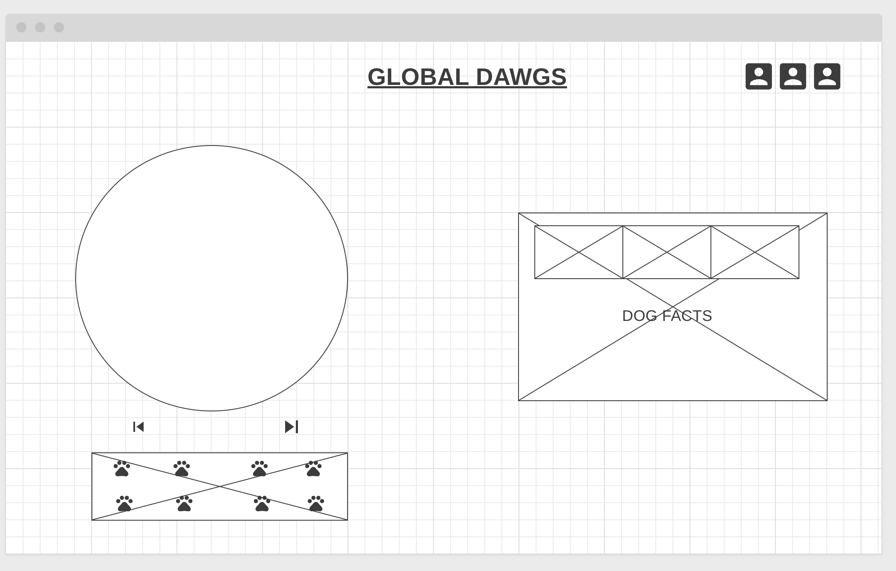

# 
Welcome to Global Dawgs!

This will be an interactive global map that will display the most popular dogs of the world and give you fun facts about that breed of dawg.I hope you enjoying learning about all the most popular dawgs of the world!!  
  
  
> ### **In Global Dawgs, here are some key features**
>
> -  Visualization of the Globe: Users will be able to view a visual representation of the globe
>
>  -  Map Navigation: Users can navigate the map and globe using arrow keys (left and right) to explore different continents. 
>
> - Continent Selection: Users will have the ability to click on a continent of interest to learn more about the popular dog breeds found in that specific region.
>
> - Comparison of Dog Breeds: The project will include a feature that allows users to compare one dog vs another on abitrary statistics.
>
> ### **In addition, this project will include:**
>
> -  A readme and instructions on how to interact with the map 
> -  A visually appealing UI
> -  Ambient background music

## 
**Wireframe**

###
- Nav links in the top right for github and linkedIn 
- A box with profile pictures of al the dogs plus my favorite dog
- A globe in the first third of the page that will be able to rotate left or right with the buttons and with the keys 
- When you click on a profile or on the globe, a profile of the dog show up with (x) amount pictures and facts about the dog 

> ## **Technologies, Libraries, APIs**
> ### This project will be implemented with the following technologies:
>
> - D3 - Data Driven Documents
> - Webpack and Babel to bundle and transpile the sourceJavaScript code
> -  npm to manage project dependencies
> - The Dog API - A public service API all about Dogs, free to use when making your fancy new App, Website or Service
> - api.globe - API for accessing GLOBE data
>

## **Implementation Timeline**
- Friday Afternoon & Weekend: Setup project, including getting webpack up and running. Learn about the api and what informatin i' ll need or want to use.  Look into the globe part and how I will render this part. Finalize my wireframe.

- Monday: Get buttons and assests on the page even if they are not placed properly.Start figuring out the logic behind the profile pictures and globe more  

- Tuesday: Work on buttons and links and the logic for this / Start styling and getting thing splaced correctly

- Wednesday: Finish implementing style and functionality of everything

- Thursday Morning: Deploy to GitHub pages. If time, rewrite this proposal as a production README.